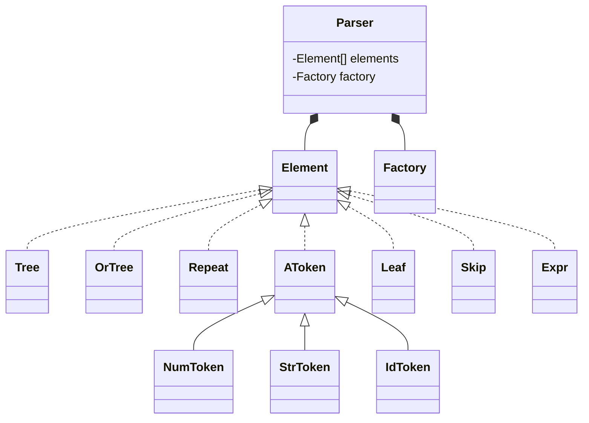

```mermaid
classDiagram
  Parser *-- Element
  Parser *-- Factory
  Element <|.. Tree
  Element <|.. OrTree
  Element <|.. Repeat
  Element <|.. AToken
  Element <|.. Leaf
  Element <|.. Skip
  Element <|.. Expr
  AToken <|-- NumToken
  AToken <|-- StrToken
  AToken <|-- IdToken

  class Parser {
    -Element[] elements
    -Factory factory
  }
  class Factory{

  }
  class Element{

  }
```