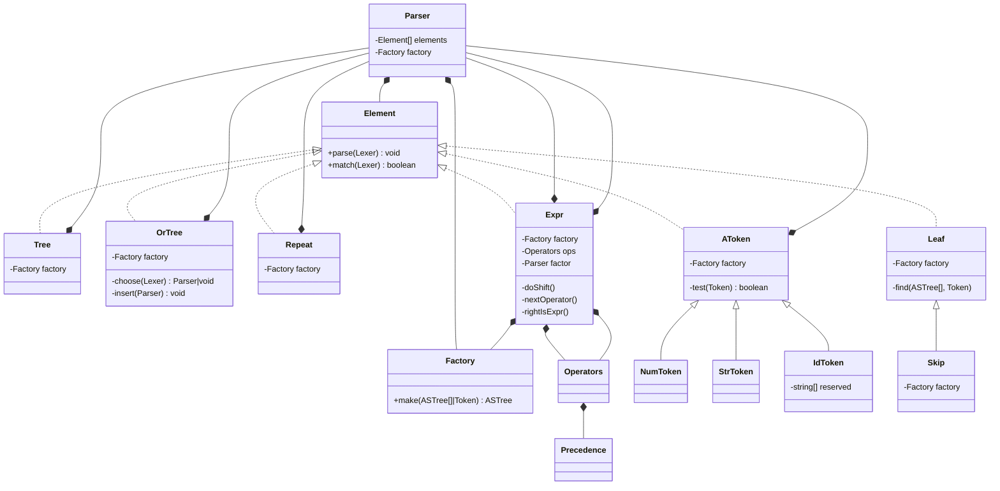

Parser主要为以下三大类：
**Parser**
对外暴露的主类，实现了一系列的串行调用函数，接口实现BNF语法
包含了Element[], Factory，其中Element可以理解为规则，Factory理解为创建ASTree的工厂函数
Parser类的作用主要有两个：通过BNF函数将规则存入Element[]、通过parse函数遍历Element[]创建ASTree

除了终结符函数（number, identifier, string），其他接收之前创建parser的函数，参数都接收parser类型
每调用一次，就在Element[]里面推一条element，而一条element，则带有parser

**Element**
规则的基类，提供基本的规则和parse函数，可以理解为Parser类的具体规则分解
parse函数大部分情况下通过一定的规则，调用parser的parse函数

Element分为两大类：叶子节点和非叶子节点，叶子节点的parse，通过其自带的factory来创建；非叶子节点的parse，通过parser来实现

**Factory**
创建ASTree的工厂
由于Parser和Element都有parse功能，所以Parser和Element都带有一个Factory

**AToken**
token的基类，不被直接创建

类图如下:

