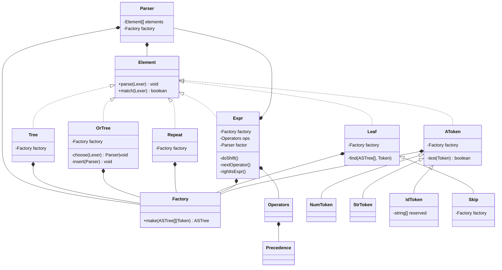

**Parser**
对外暴露的类，实现了一系列的串行调用函数，接口实现BNF语法
包含了Element[], Factory，其中Element可以理解为规则，Factory理解为创建ASTree的工厂函数

**Element**
规则的基类，提供

**Factory**
创建ASTree的工厂

**AToken**
token的基类，不被直接创建

类图如下:

```mermaid
classDiagram
  Parser *-- Element
  Parser *-- Factory
  Element <|.. Tree
  Element <|.. OrTree
  Element <|.. Repeat
  Element <|.. AToken
  Element <|.. Leaf
  Element <|.. Expr
  Expr *-- Parser
  Expr *-- Operators
  AToken <|-- NumToken
  AToken <|-- StrToken
  AToken <|-- IdToken
  Leaf <|-- Skip
  Tree *-- Factory
  OrTree *-- Factory
  Repeat *-- Factory
  Leaf *-- Factory
  Expr *-- Factory
  AToken *-- Factory
  Operators *-- Precedence

  class Parser {
    -Element[] elements
    -Factory factory
  }
  class Factory{
    +make(ASTree[]|Token) ASTree
  }
  class Element{
    +parse(Lexer)void
    +match(Lexer)boolean
  }
  class Tree {
    -Factory factory
  }
  class OrTree {
    -Factory factory
    -choose(Lexer) Parser|void
    -insert(Parser) void
  }
  class Repeat {
    -Factory factory
  }
  class Leaf {
    -Factory factory
    -find(ASTree[], Token)
  }
  class Skip {
    -Factory factory
  }
  class Expr {
    -Factory factory
    -Operators ops
    -Parser factor
    -doShift()
    -nextOperator()
    -rightIsExpr()
  }
  class AToken {
    -Factory factory
    -test(Token) boolean
  }
  class IdToken {
    -string[] reserved
  }
```